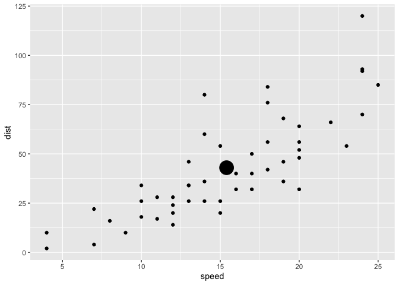
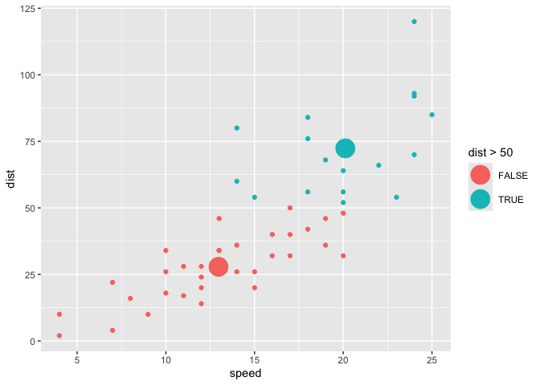

  - [Welcome to the ggtedious
    workshop\!](#welcome-to-the-ggtedious-workshop)
  - [Part 1. Work on functionality](#part-1-work-on-functionality)
      - [Step 0. Do it with base ggplot2 *can become problem statement
        later*](#step-0-do-it-with-base-ggplot2-can-become-problem-statement-later)
      - [Step 0.b Write like-to-have code *code chunk option eval =
        F*](#step-0b-write-like-to-have-code-code-chunk-option-eval--f)
      - [Step 1. Write compute group function and
        test](#step-1-write-compute-group-function-and-test)
      - [Step 2. Pass to ggproto object](#step-2-pass-to-ggproto-object)
      - [Step 3. Write user-facing geom\_pointmeans()
        function](#step-3-write-user-facing-geom_pointmeans-function)
      - [Step 4. Test it out enjoy\! (possibly basis of examples and
        tests)](#step-4-test-it-out-enjoy-possibly-basis-of-examples-and-tests)
      - [Step 5. Write messages/warnings etc in the
        function](#step-5-write-messageswarnings-etc-in-the-function)
  - [Part II. Packaging and documentation 🚧
    ✅](#part-ii-packaging-and-documentation--)
      - [Phase 1. Minimal working
        package](#phase-1-minimal-working-package)
          - [Bit A. Created package archetecture, running
            `devtools::create(".")` in interactive session. 🚧
            ✅](#bit-a-created-package-archetecture-running-devtoolscreate-in-interactive-session--)
          - [Bit B. Added roxygen skeleton? 🚧
            ✅](#bit-b-added-roxygen-skeleton--)
          - [Bit C. Managed dependencies ? 🚧
            ✅](#bit-c-managed-dependencies---)
          - [Bit D. Moved functions R folder? 🚧
            ✅](#bit-d-moved-functions-r-folder--)
          - [Bit E. Run `devtools::check()` and addressed errors. 🚧
            ✅](#bit-e-run-devtoolscheck-and-addressed-errors--)
          - [Bit F. Build package 🚧 ✅](#bit-f-build-package--)
          - [Bit G. Write traditional README that uses built package
            (also serves as a test of build. 🚧
            ✅](#bit-g-write-traditional-readme-that-uses-built-package-also-serves-as-a-test-of-build--)
          - [Bit H. Chosen a license? 🚧 ✅](#bit-h-chosen-a-license--)
          - [Bit I. Add lifecycle badge (experimental) 🚧
            ✅](#bit-i-add-lifecycle-badge-experimental--)
      - [Phase 2: Listen & iterate 🚧 ✅](#phase-2-listen--iterate--)
      - [Phase 3: Let things settle](#phase-3-let-things-settle)
          - [Bit A. Settle on examples. Put them in the roxygen skeleton
            and readme. 🚧
            ✅](#bit-a-settle-on-examples-put-them-in-the-roxygen-skeleton-and-readme--)
          - [Bit B. Written formal tests of functions and save to test
            that folders 🚧
            ✅](#bit-b-written-formal-tests-of-functions-and-save-to-test-that-folders--)
          - [Bit C. Added a description and author information in the
            DESCRIPTION file 🚧
            ✅](#bit-c-added-a-description-and-author-information-in-the-description-file--)
          - [Bit D. Addressed *all* notes, warnings and errors.
            🚧](#bit-d-addressed-all-notes-warnings-and-errors-)
      - [Phase 4. Promote to wider
        audience…](#phase-4-promote-to-wider-audience)
          - [Bit A. Package website built?
            ✅](#bit-a-package-website-built-)
          - [Bit B. Package website deployed? 🚧
            ✅](#bit-b-package-website-deployed--)
      - [Phase 5: Harden/commit](#phase-5-hardencommit)
          - [Submit to CRAN/RUniverse? 🚧](#submit-to-cranruniverse-)
  - [Appendix: Reports, Environment](#appendix-reports-environment)
      - [Edited Description file?](#edited-description-file)

<!-- README.md is generated from README.Rmd. Please edit that file -->

# Welcome to the ggtedious workshop\!

<!-- badges: start -->

<!-- badges: end -->

Let’s build a vanilla ggplot2 Stat and use it in an extension function.

# Part 1. Work on functionality

## Step 0. Do it with base ggplot2 *can become problem statement later*

``` r
library(tidyverse)
#> ── Attaching core tidyverse packages ─────────────────── tidyverse 2.0.0.9000 ──
#> ✔ dplyr     1.1.0          ✔ readr     2.1.4     
#> ✔ forcats   1.0.0          ✔ stringr   1.5.0     
#> ✔ ggplot2   3.4.4.9000     ✔ tibble    3.2.1     
#> ✔ lubridate 1.9.2          ✔ tidyr     1.3.0     
#> ✔ purrr     1.0.1          
#> ── Conflicts ────────────────────────────────────────── tidyverse_conflicts() ──
#> ✖ dplyr::filter() masks stats::filter()
#> ✖ dplyr::lag()    masks stats::lag()
#> ℹ Use the conflicted package (<http://conflicted.r-lib.org/>) to force all conflicts to become errors

cars_means_df <- cars |>
  summarise(dist = mean(dist),
            speed = mean(speed))

ggplot(data = cars) + 
  aes(speed, dist) + 
  geom_point() + 
  geom_point(data = cars_means_df, size = 8)
```

<!-- -->

## Step 0.b Write like-to-have code *code chunk option eval = F*

    ggplot(data = cars) + 
      aes(speed, dist) + 
      geom_point() + 
      geom_pointmeans(size = 8)

## Step 1. Write compute group function and test

## Step 2. Pass to ggproto object

reference:
<https://evamaerey.github.io/mytidytuesday/2022-01-03-easy-geom-recipes/easy_geom_recipes.html>

``` r
compute_group_means <- function(data, scales){
  
  data |>
    summarise(x = mean(x),
              y = mean(y))
  
}


StatMeans <- ggproto(`_class` = "StatMeans",
                     `_inherit` = Stat,
                     compute_group = compute_group_means,
                     required_aes = c("x", "y"))
```

``` r
cars |>
  select(x = speed, y = dist) |>
  compute_group_means()
#>      x     y
#> 1 15.4 42.98
```

``` r
ggplot(data = cars) + 
  aes(speed, dist) + 
  geom_point() + 
  layer(stat = StatMeans, 
        geom = GeomPoint, 
        position = "identity",
        params = list(size = 8)) 
```

<!-- -->

``` r

# defining params is not always required.
# we just use it hear so that our means point is obvious
```

## Step 3. Write user-facing geom\_pointmeans() function

``` r
geom_pointmeans <- function(mapping = NULL, 
                            data = NULL,
                            position = "identity", 
                            na.rm = FALSE,
                            show.legend = NA,
                            inherit.aes = TRUE, ...) {
  ggplot2::layer(
    stat = StatMeans,        # proto object from step 2
    geom = ggplot2::GeomPoint,   # inherit other behavior
    data = data, 
    mapping = mapping,
    position = position, 
    show.legend = show.legend, 
    inherit.aes = inherit.aes,
    params = list(na.rm = na.rm, ...)
  )
}
```

## Step 4. Test it out enjoy\! (possibly basis of examples and tests)

``` r
ggplot(data = cars) + 
  aes(speed, dist) + 
  geom_point() + 
  geom_pointmeans(size = 8)
```

<!-- -->

``` r

last_plot() + 
  aes(color = dist > 50)
```

<!-- -->

## Step 5. Write messages/warnings etc in the function

# Part II. Packaging and documentation 🚧 ✅

## Phase 1. Minimal working package

### Bit A. Created package archetecture, running `devtools::create(".")` in interactive session. 🚧 ✅

``` r
devtools::create(".")
```

### Bit B. Added roxygen skeleton? 🚧 ✅

Use a roxygen skeleton for auto documentation and making sure proposed
functions are *exported*. Generally, early on, I don’t do much
(anything) in terms of filling in the skeleton for documentation,
because things may change.

### Bit C. Managed dependencies ? 🚧 ✅

Package dependencies managed, i.e. `depend::function()` in proposed
functions and declared in the DESCRIPTION

``` r
usethis::use_package("ggplot2")
```

### Bit D. Moved functions R folder? 🚧 ✅

Use new {readme2pkg} function to do this from readme…

``` r
library(tidyverse)
readme2pkg::chunk_to_r("geom_post")
```

### Bit E. Run `devtools::check()` and addressed errors. 🚧 ✅

``` r
devtools::check(pkg = ".")
```

### Bit F. Build package 🚧 ✅

``` r
devtools::build()
```

### Bit G. Write traditional README that uses built package (also serves as a test of build. 🚧 ✅

The goal of the {ggtedious} package is to make it easy to draw posts
(and to learn about package building and testing)

Install package with:

    remotes::install_github("EvaMaeRey/ggvanilla")

Once functions are exported you can remove go to two colons, and when
things are are really finalized, then go without colons (and rearrange
your readme…)

``` r
library(ggvanilla)  
```

### Bit H. Chosen a license? 🚧 ✅

``` r
usethis::use_mit_license()
```

### Bit I. Add lifecycle badge (experimental) 🚧 ✅

``` r
usethis::use_lifecycle_badge("experimental")
```

## Phase 2: Listen & iterate 🚧 ✅

Try to get feedback from experts on API, implementation, default
decisions. Is there already work that solves this problem?

## Phase 3: Let things settle

### Bit A. Settle on examples. Put them in the roxygen skeleton and readme. 🚧 ✅

### Bit B. Written formal tests of functions and save to test that folders 🚧 ✅

That would look like this…

``` r
library(testthat)

test_that("calc times 2 works", {
  expect_equal(times_two(4), 8)
  expect_equal(times_two(5), 10)
  
})
```

``` r
readme2pkg::chunk_to_tests_testthat("test_calc_times_two_works")
```

### Bit C. Added a description and author information in the DESCRIPTION file 🚧 ✅

### Bit D. Addressed *all* notes, warnings and errors. 🚧

## Phase 4. Promote to wider audience…

### Bit A. Package website built? ✅

``` r
usethis::use_pkgdown()
pkgdown::build_site()
```

### Bit B. Package website deployed? 🚧 ✅

## Phase 5: Harden/commit

### Submit to CRAN/RUniverse? 🚧

# Appendix: Reports, Environment

## Edited Description file?

``` r
readLines("DESCRIPTION")
```
